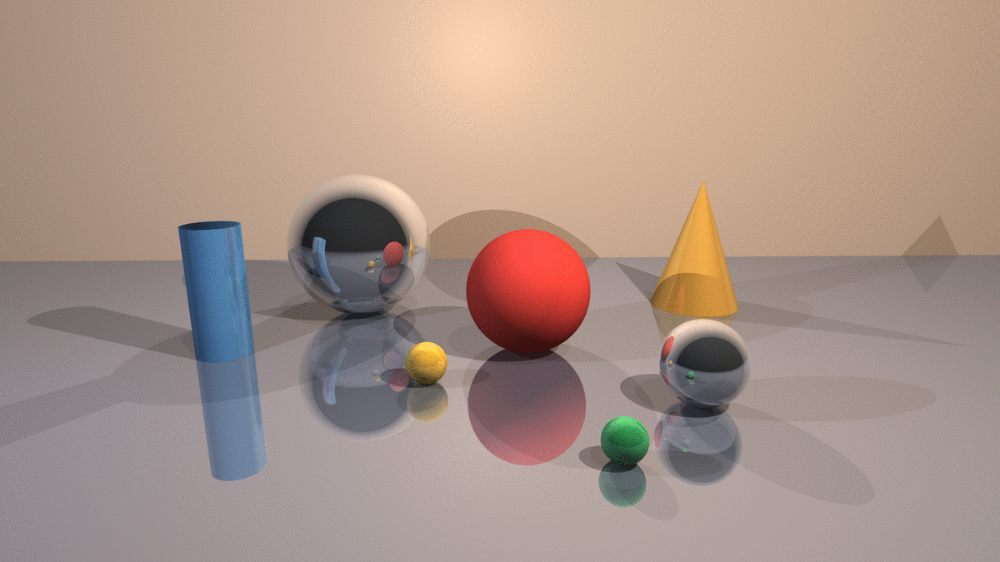
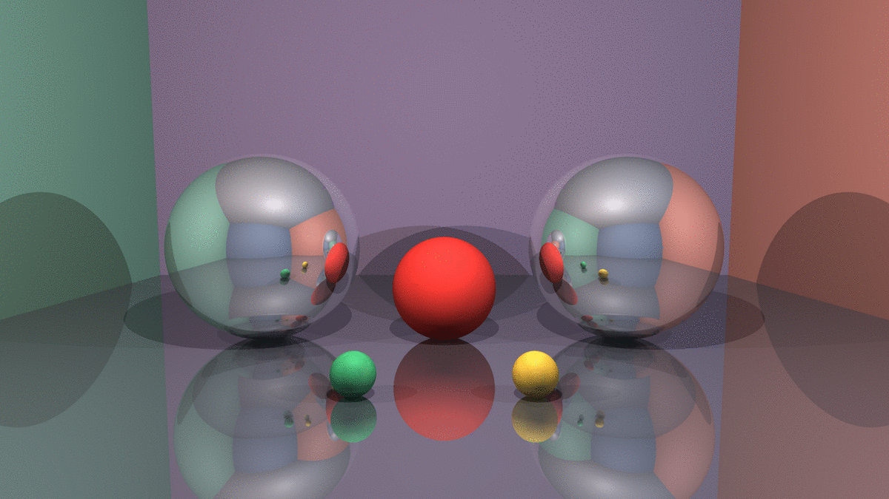
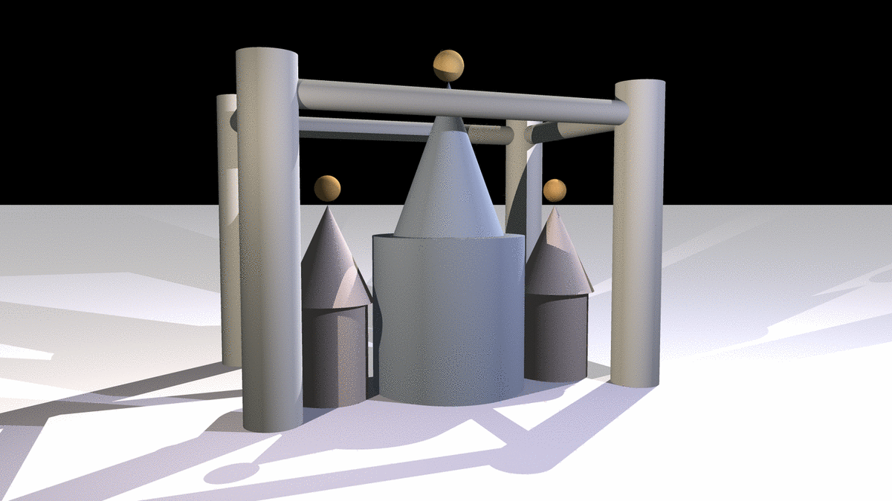

# Retsu

A ray tracer written from scratch in C++17 with no graphics library, no math
library, and no scene-graph framework. It does analytic intersections for four
primitives, recursive reflection, hard shadows, supersampled anti-aliasing, an
OpenMP-parallel render loop, and reads scenes from a text format with its own
parser.



*1600x900, 9 rays per pixel, rendered in 2.0 s.*

---

## Gallery



*Two mirrors facing each other across a matte subject. Each one carries the
other's image, which carries the first again. `--depth` controls how many
generations of that nesting get traced. 1600x900, 9 rays per pixel, depth 8,
1.7 s.*



*Twenty-seven primitives: capped cylinders, cones, spheres and planes, with five
light sources. 1920x1080, 9 rays per pixel, 2.8 s.*

## What it does

**Geometry.** Sphere, plane, finite capped cylinder, finite cone. Every
intersection is solved analytically. The cylinder and cone reduce to quadratics
once the ray is projected onto the primitive's axis, with the caps handled as
separate plane tests and the result clipped to the primitive's height.

**Light transport.** Ambient, point and directional sources. Lambertian diffuse
shading, hard shadows from shadow rays, and recursive specular reflection to a
configurable depth.

**Sampling.** Optional regular supersampling at `n` by `n` rays per pixel,
averaged.

**Parallelism.** The row loop is an OpenMP parallel region. Every pixel is
independent and nothing is shared for writing, so the renderer needs no
synchronisation anywhere.

**Scene format.** A small INI-like language (`.rts`) with its own tokenizer and
section reader. No JSON, no YAML, no dependency. Full reference in
[`docs/scene-format.md`](docs/scene-format.md).

## Build and run

```bash
make
./retsu scenes/showcase.rts -s 3
```

```
Usage: ./retsu <scene.rts> [options]

  -r, --realtime       progressive preview while rendering (SFML)
  -s, --samples N      N x N rays per pixel, default 1
  -d, --depth N        maximum reflection depth, default 5
  -o, --output FILE    output file, default <scene>.ppm
  -h, --help
```

Both optional dependencies can be switched off, and the build stays
warning-clean under `-Wall -Wextra -Werror` either way:

```bash
make USE_SFML=0         # no preview window
make USE_OPENMP=0       # single-threaded
```

Output is binary PPM (P6). `make demo` renders the bundled scenes.

To see what recursion buys, render the same scene at three depths:

```bash
./retsu scenes/reflections.rts -s 2 -d 1    # no reflection at all
./retsu scenes/reflections.rts -s 2 -d 2    # one bounce
./retsu scenes/reflections.rts -s 2 -d 8    # the full corridor
```

## Scene format

```ini
[Camera]
position = 0, 1.1, -7.2
lookAt = 0, 0.35, 0.6
fov = 48
resolution = 1600, 900

[Sphere]
center = -2.6, 0.35, 1.0
radius = 1.35
color = 0.94, 0.95, 0.98
reflectivity = 0.90        # 0 = matte, 1 = mirror

[PointLight]
position = 0, 4.6, -3.5
intensity = 0.80
color = 1.0, 0.95, 0.88
```

Sections map onto factories. `PrimitiveFactory` builds geometry, `LightFactory`
builds sources, and `SceneBuilder` assembles them. Adding a primitive means
writing one class against `IPrimitive` and one branch in the factory; nothing
in the renderer or the parser changes.

Every property getter takes a default, so adding a property never breaks an
existing scene file. `reflectivity` was introduced that way and defaults to 0,
which is why scenes written before reflection existed still render identically.

## Performance

Measured on an Intel i5-8350U with 4 physical cores and 8 logical threads.

| Scene | 1 ray/px | 16 rays/px |
|---|---:|---:|
| `demo_scene` (1920x1020) | 0.06 s | |
| `reflections` (1600x900) | 0.19 s | 3.09 s |
| `showcase` (1600x900) | 0.24 s | 3.53 s |
| `architecture_hd` (1920x1080) | 0.30 s | |

Parallel scaling on `showcase` at 16 rays per pixel, a workload heavy enough
that the measurement is about the renderer rather than about process startup:

| | Time | Speedup |
|---|---:|---:|
| `USE_OPENMP=0` | 16.29 s | 1.0x |
| 8 threads | 3.67 s | **4.4x** |

4.4x on four physical cores is about what this workload should give. The second
thread on each core shares an execution unit, so hyperthreading adds throughput
but not another core's worth.

The loop uses `schedule(dynamic)` rather than static partitioning. Row cost
varies by an order of magnitude, since a row of empty background costs almost
nothing while a row crossing mirrored surfaces costs several bounces. A static
split would leave cores idle waiting for the unlucky ones to finish.

## Design

```
core/       Vector3, Color, Ray            value types, header-only
objects/    IPrimitive + 4 primitives      analytic intersection
            PrimitiveFactory               section to primitive
lights/     ILight + 3 light types
            LightFactory                   section to light
parser/     SceneParser, SceneSection      .rts tokenizer
scene/      Scene, Camera, SceneBuilder    assembly, ray generation
renderer/   Renderer                       trace, shade, sample, write
display/    RealTimeDisplay                SFML preview, compiled out by default
```

Two decisions are worth pointing at.

**No type queries in the hot loop.** `ILight` exposes `isAmbient()` and
`distanceFrom(point)`. An earlier version instead ran `dynamic_cast` against
each concrete light type, for every light, at every pixel. Asking a polymorphic
hierarchy what it is from the outside is exactly what virtual dispatch exists to
avoid, and it was being paid several million times per frame. Each light now
answers for itself, and the shadow test reads as one comparison: an occluder
farther away than the source blocks nothing, and a directional source reports
infinite distance so the general case covers it with no special branch.

**One flat buffer.** The image is a single `std::vector<Color>` indexed
arithmetically rather than a vector of row vectors. A row-of-rows layout
scatters rows across the heap and defeats the cache on exactly the sequential
access the renderer performs.

## Notes from the cleanup

This began as a school project. Bringing it to its current state turned up four
things worth naming, because each is a category of bug rather than a one-off.

**Reflection was declared but never wired.** `traceRay` accepted a `depth`
argument and compared it against `maxDepth`, but never called itself. A
`reflect` helper sat in `vector_utils.hpp`, unused. Recursion is the thing that
makes this a ray tracer rather than a ray caster, and it was the missing piece.

**The cone normal was wrong in two ways at once.** For a cone with apex `A`,
unit axis `a` and half-angle `θ`, the outward normal is `r̂ − tan(θ)·a`, which
checks in one line: the tangent along the slant is `a + tan(θ)·r̂`, and the dot
product of the two is zero. The code computed `r̂ + cot(θ)·a`, inverting the sign
of the axial term and swapping the tangent for its cotangent. At a half-angle of
19 degrees that put 2.90 of axial component in the wrong direction instead of
0.344 in the right one, so the normal pointed into the cone, every dot product
with an overhead light came out negative, and **cones rendered as flat black
silhouettes**. Compare the towers in the architecture scene above against any
render from before the fix.

**The directional light pointed backwards.** `ILight::getDirection` is
documented as returning the vector toward the source. `DirectionalLight`
returned the direction of propagation, its exact opposite. Every surface facing
such a light got a negative dot product, clamped to zero, so directional lights
contributed nothing at all. `PointLight` had it right, which is why the bug
survived: the scenes still looked lit.

**The no-SFML build did not compile.** With `USE_SFML=0` the stub bodies left
their parameters unused and `-Werror` rejected them. The documented fallback had
never been exercised.

One more thing, which is a property of the renderer rather than a bug in it: a
point light placed exactly in the plane of a surface makes shadow tests
undecidable. The shadow ray grazes that surface at a distance equal to the
light's own, the comparison becomes a coin flip decided by rounding, and the
result is a fine speckle over everything the light touches. It is documented in
the scene format reference, because the fix belongs in the scene, not the code.

Also added: OpenMP, supersampling, binary PPM output (a 1920x1080 frame drops
from 18 MB to 6 MB, and writing it no longer costs more than rendering it),
`-O2`, a distance-proportional shadow bias, header dependency tracking in the
Makefile, and a real command-line interface.

## Limitations

- **Reflection only.** No refraction, no transmission, no Fresnel term. There is
  no material model beyond a colour and a reflectivity scalar, so no specular
  highlight and no roughness.
- **Hard shadows only.** Point sources are dimensionless, so shadow edges are
  binary. Soft shadows need area lights and several shadow rays per point.
- **No acceleration structure.** Every ray tests every primitive. That is fine
  for the dozens of objects here; a BVH is what the next order of magnitude
  needs.
- **Regular supersampling.** Grid samples, not stratified or jittered, so
  high-frequency detail can still alias into a pattern rather than into noise.
- **Scalar maths.** Vector operations are plain `float`. The intersection
  routines are the obvious candidates for vectorisation and are not vectorised.

## Credits

A three-person project, originally built as a school assignment in May 2025.

- [@aurelatioukpe](https://github.com/aurelatioukpe): renderer, primitives and
  intersection maths, `.rts` parser, factories and scene assembly, SFML preview,
  and the cleanup described above
- Halim Sonou-Agossou: primitives, build integration
- [@Omonlola](https://github.com/Omonlola) : scene authoring and testing

## License

MIT. See `LICENSE`.
